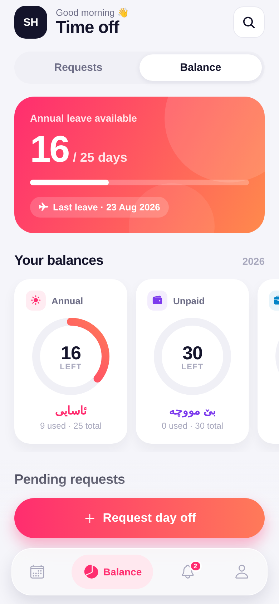
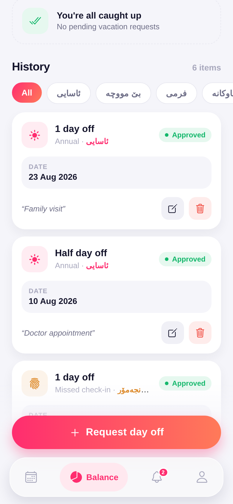
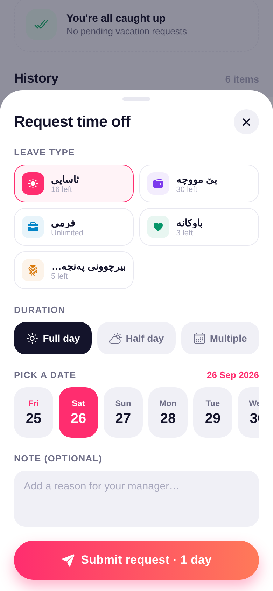
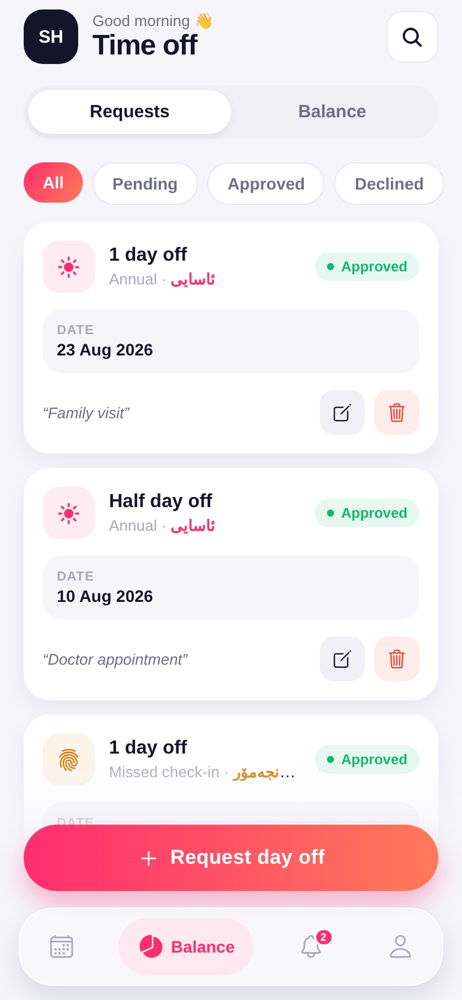
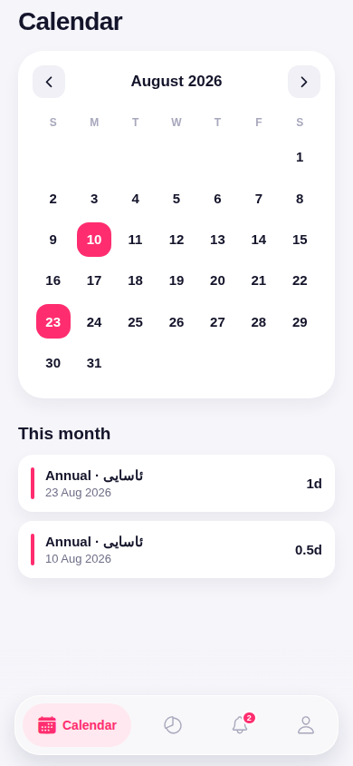
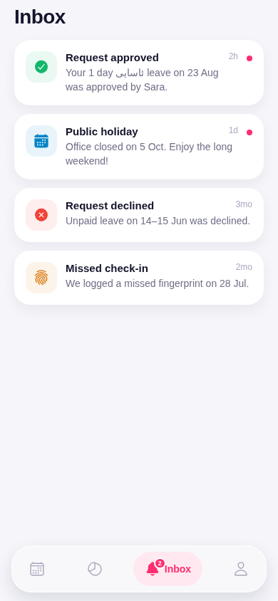
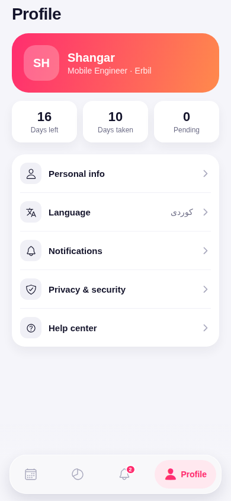

# Day Off — modern time-off app (iOS & Android)

A modern redesign of a leave/day-off mobile interface, built with **Expo + React Native + TypeScript**. It runs on iOS, Android, and web from one codebase.

| Balance | History | Request sheet | Requests |
|---|---|---|---|
|  |  |  |  |

| Calendar | Inbox | Profile |
|---|---|---|
|  |  |  |

## What's new compared to the original design

- **Gradient hero card** showing annual leave left, with a progress bar
- **Animated gradient progress rings** for each leave type (ئاسایی, بێ مووچە, فرمی, باوکانە, بیرچوونی پەنجەمۆر), with an icon and English label
- **Sliding segmented control** for Requests / Balance
- **Gradient filter chips** that scroll sideways
- **Request cards** with a leave-type icon, a status pill (Approved / Pending / Declined), a date panel, the note, and soft edit/delete buttons
- **Floating frosted-glass tab bar**: the active tab shows as a pill with its label, and Inbox has an unread badge
- **Bottom sheet** for requesting or editing time off: pick a leave type, full / half / multiple days, a date strip, and a note
- Calendar with leave days in color, plus Inbox and Profile screens

## Run it

```bash
npm install
npx expo start          # scan the QR code with Expo Go (iOS / Android)
npx expo start --web    # open in the browser
```

## Structure

```
App.tsx                     # app shell: tabs, floating CTA, request sheet
src/theme.ts                # colors, gradients, radii, shadows
src/data.ts                 # leave types, mock requests, date helpers
src/components/             # ProgressRing, BalanceCard, SegmentedControl, FilterChips,
                            # RequestCard, StatusPill, GradientButton, TabBar, RequestSheet
src/screens/                # TimeOffScreen, CalendarScreen, NotificationsScreen, ProfileScreen
```

The data is mock data in `src/data.ts`. Swap it for your API when you connect a backend.
