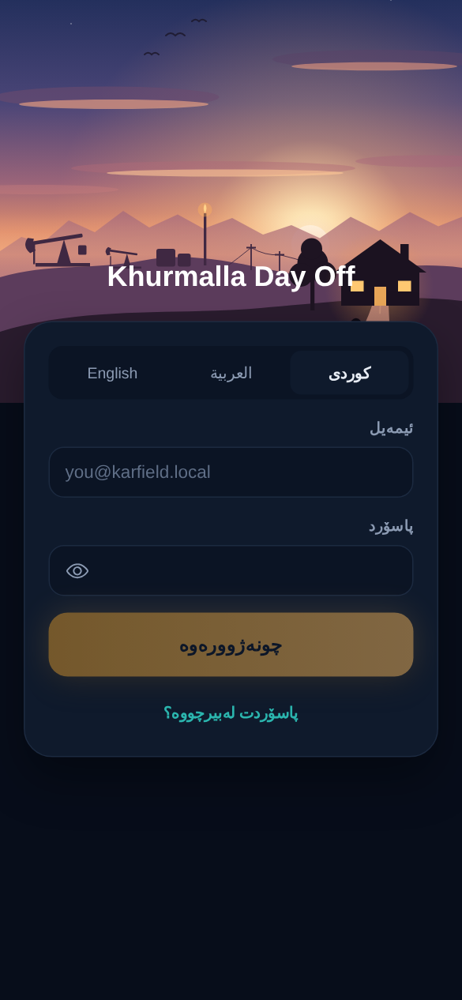
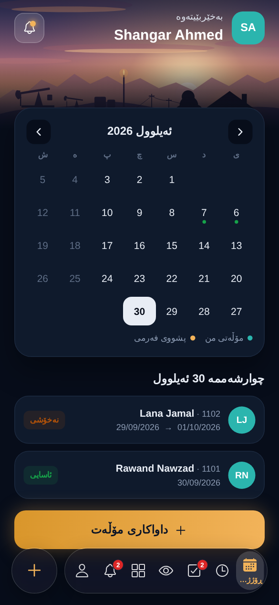
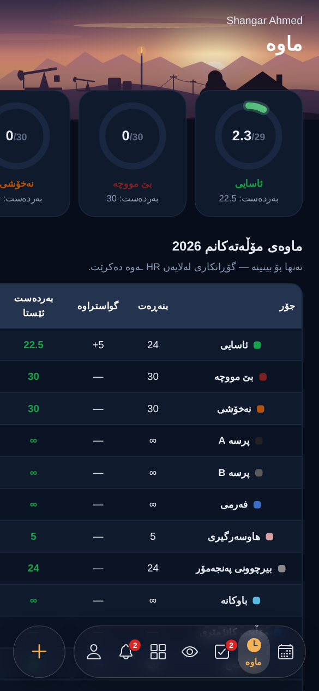
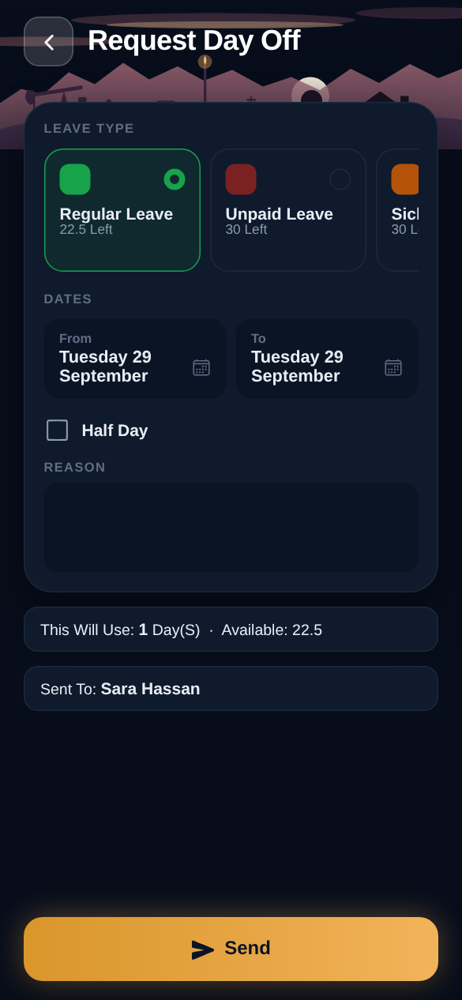
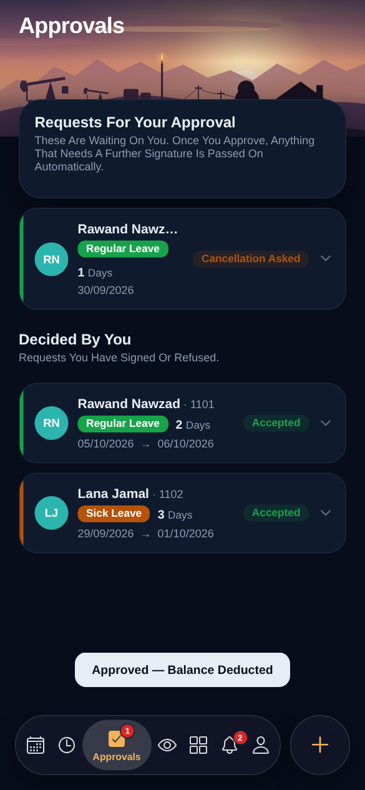
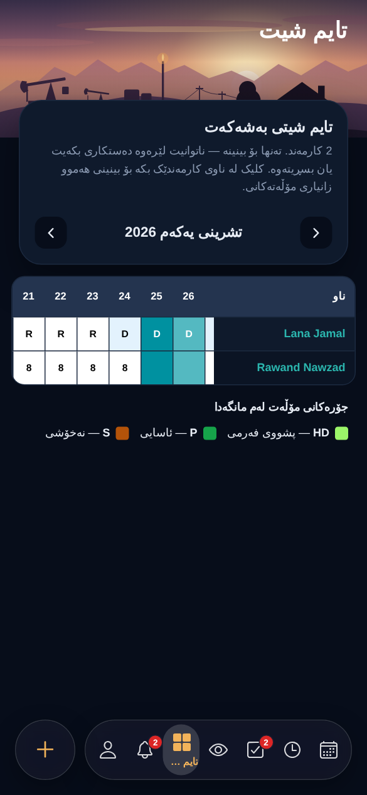
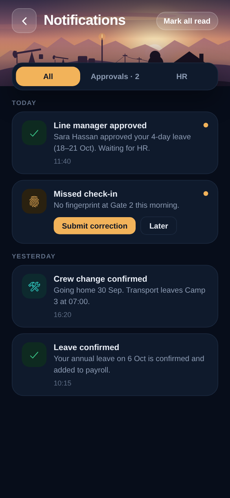
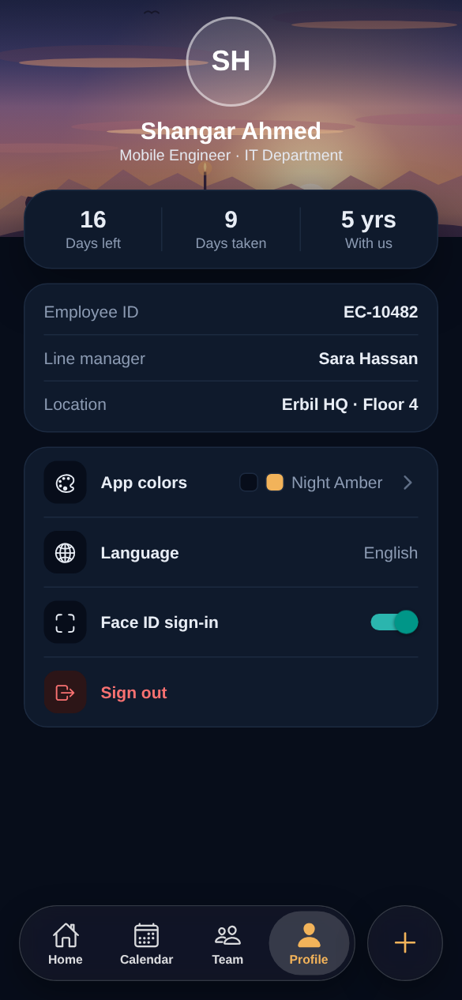

# Khurmalla Day Off: mobile app (iOS & Android)

The phone app for **Khurmalla Day Off**, the Kar leave system that runs at [dayoff.kar-prod.com](https://dayoff.kar-prod.com/). It is built with **Expo + React Native + TypeScript + Expo Router** and runs on iOS, Android and the web.

The app uses **the same Firebase project and the same data as the website**. People sign in with their website email and password, and every request, approval and notification is shared: a request sent from the phone appears on the website at once, and the other way round.

The leave rules are ported one to one from the website, so both compute the same numbers:
- which days a request costs (Friday, Saturday and holidays are free, except for sick leave)
- balances, monthly accrual and carry-over, on the leave year that runs 21 December → 20 December
- per-request and per-month limits, once-only types, and hourly leave (8 hours = 1 day)
- who signs, in what order (line manager, team second approver, HR Director, General Director, doctor for sick leave)

The app is in **Kurdish, English and Arabic**. Kurdish and Arabic are laid out right to left.

| Sign in | Calendar | Balance | Request |
|---|---|---|---|
|  |  |  |  |

| Approvals | Timesheet | Notifications | Profile |
|---|---|---|---|
|  |  |  |  |

_Screenshots use made-up sample people, not real company data._

## Screens (the website's employee app)

- **Calendar**: your approved leave and official holidays for the month; tap a day to see who is off.
- **Balance**: a ring per leave type, the balance table (base, carried, available now, used, remaining), pending requests, and your full history in month and year folders. You can edit or remove your own requests; changing or cancelling approved leave is sent to your approvers.
- **Request day off**: all 12 leave types, dates, half day, hours for hourly leave, reason, and a medical document for sick leave. Before you send, it shows what the request will use and who has to sign.
- **Approvals** (for approvers): approve or reject requests waiting on you, answer change and cancellation requests, and see what you decided before.
- **Watching** (for watchers set on the Teams page): leave in the units you watch, view only.
- **Timesheet** (for people with staff): the pay month (21st → 20th) for your people, view only.
- **Notifications**: approvals, decisions and changes sent to you, plus announcements.
- **Profile**: photo, password reset, language, app colors, and your work details.

Signing in also handles suspended accounts and the forced password change after the starting password, exactly as the website does. The admin console screens (Employees, Teams, Reports, Settings …) are still website-only.

## Run it

```bash
npm install
npx expo start          # scan the QR code with Expo Go (iOS / Android)
npx expo start --web    # open in the browser
```

To install a stand-alone APK on an Android emulator or a USB phone (Windows), run `.\build-apk.bat`.
The APK is written to `android\app\build\outputs\apk\release\app-release.apk`.

## Structure

```
src/app/                    # Expo Router routes
  _layout.tsx               # sign-in gate, suspended / new-password screens, RTL
  (tabs)/                   # Calendar (index), Balance, Approvals, Watching, Timesheet, Notifications, Profile
  request/new.tsx           # request day off, or change a request (?id=)
  person/[id].tsx           # someone's leave, read only
  colors.tsx                # app color palettes
src/lib/
  rules.ts                  # the website's leave rules, ported one to one
  records.ts                # live Firestore collections (employees_v2, leaves_v2, …) and settings documents
  files.ts                  # profile photos and leave documents (stored like the website)
  firebase*.ts              # Firebase setup (same project as the website)
  i18n.ts                   # Kurdish / English / Arabic
src/state/                  # session (sign-in, language), data and actions, toasts and dialogs
src/components/             # oil-field header picture, glass tab bar, leave cards, balances, calendar grid
src/theme/                  # 25 color palettes plus "make your own"
```

When the website's rules change (in its `LEAVE_TYPES`, `BUILTIN_POLICY`, `balanceFor` or `approvalChainFor`), make the same change in `src/lib/rules.ts`.
