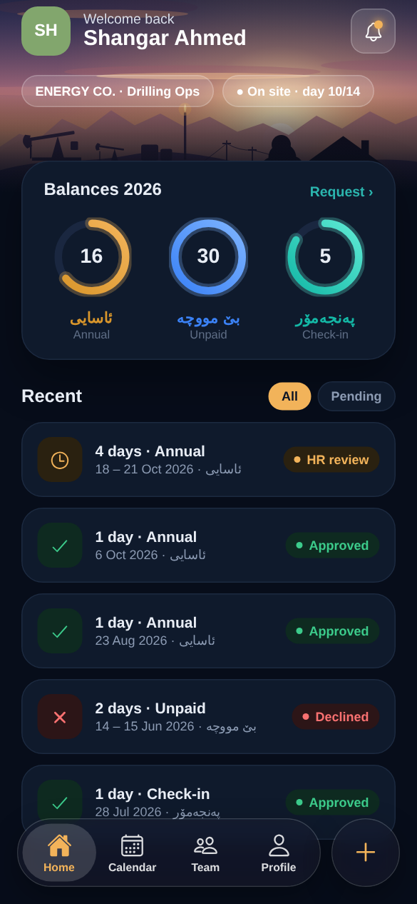
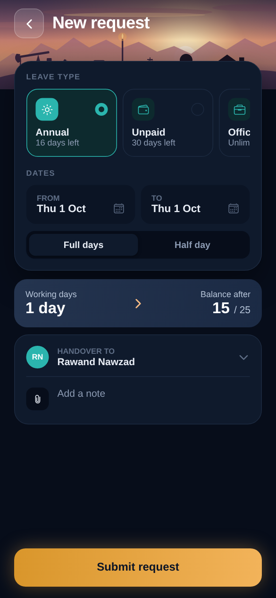
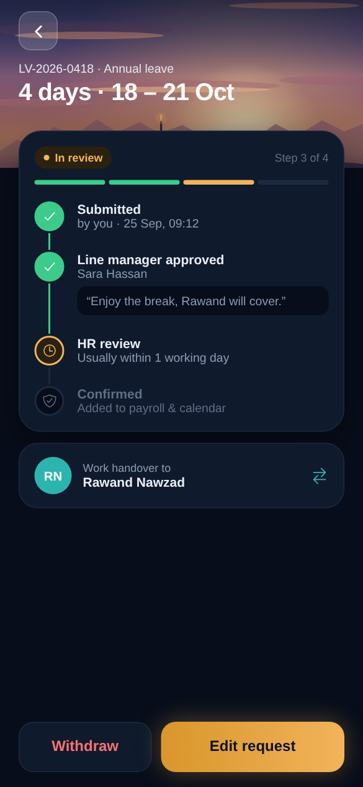
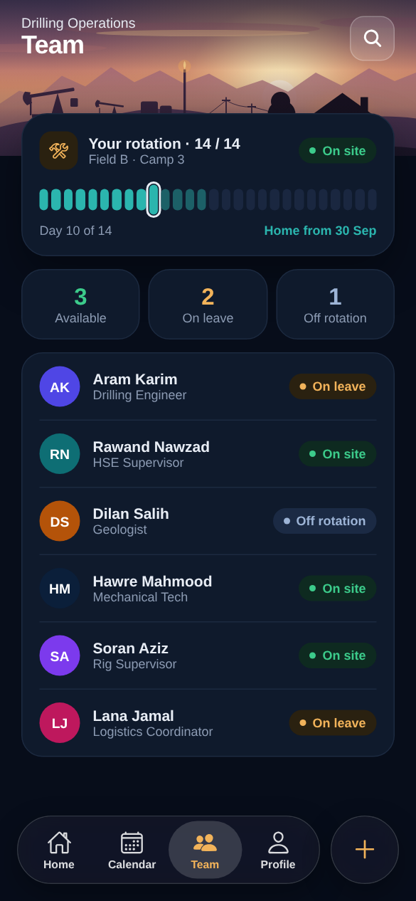
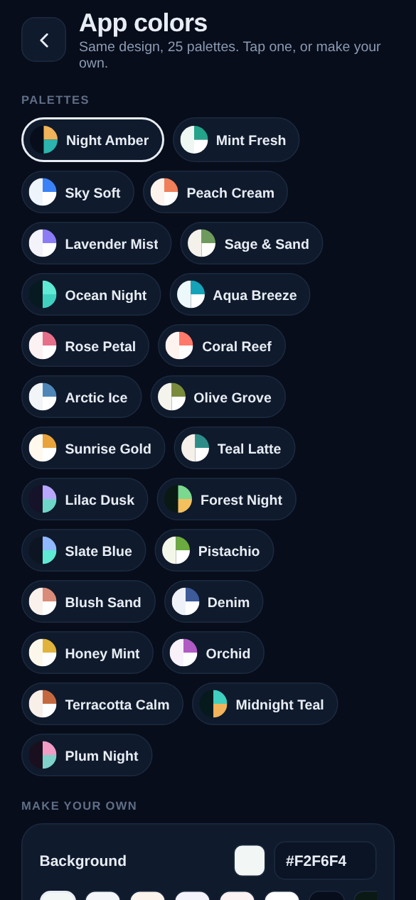
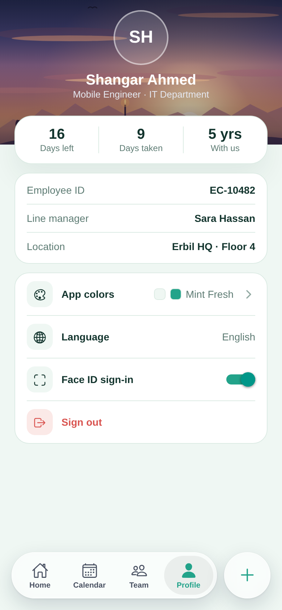

# Day Off: leave app for iOS & Android

A leave and day-off app built with **Expo + React Native + TypeScript + Expo Router**. It runs on iOS, Android and web from one codebase.

The interface follows the **Leave App Colors** design in [`design-ideas/leave-colors.html`](design-ideas/leave-colors.html): a sunset header over the oil field, cards that overlap it, a floating glass tab bar, and **25 color palettes** plus a "Make your own" option that you can switch inside the app.

| Home | Calendar | New request | Approval tracking |
|---|---|---|---|
|  |  |  |  |

| Team | Notifications | Profile | App colors | Mint Fresh palette |
|---|---|---|---|---|
|  |  |  |  |  |

## Screens

1. **Home**: balance rings for Annual (ئاسایی), Unpaid (بێ مووچە) and Check-in (پەنجەمۆر), plus recent requests with an All / Pending filter.
2. **Calendar**: a month view with approved leave, pending leave and holidays. Tap a day to see its leave and who is covering.
3. **New request**: pick a leave type, choose dates, choose full or half day, see the balance update live, then pick a handover and add a note. Weekends (Friday and Saturday) and holidays are not counted.
4. **Approval tracking**: every approval step (Submitted, Line manager, HR, Confirmed), with Withdraw and Edit.
5. **Team**: your rotation progress, who is on site, on leave or off rotation, and a search.
6. **Notifications**: opens from the bell on Home. It has All / Approvals / HR tabs, "Mark all read", and a "Submit correction" action for a missed check-in.
7. **Profile**: your stats, your work details and settings, including **App colors**, where you choose the palette.

## Run it

```bash
npm install
npx expo start          # scan the QR code with Expo Go (iOS / Android)
npx expo start --web    # open in the browser
```

## Structure

```
src/app/                    # Expo Router routes
  _layout.tsx               # root stack + theme and data providers
  (tabs)/                   # Home (index), Calendar, Team, Profile + glass tab bar
  request/new.tsx           # new / edit request (modal)
  request/[id].tsx          # approval tracking
  notifications.tsx
  colors.tsx                # palette picker + "Make your own"
src/theme/                  # palettes.ts (25 palettes), build.ts (custom palette), ThemeProvider
src/components/             # SunsetScene, HeroScreen, GlassTabBar, BalanceRing, MonthGrid, RequestCard, ui
src/data.ts                 # leave types, team, sample requests, date and balance helpers
src/store.tsx               # requests + notifications state
```

The data is sample data in `src/data.ts`. Replace it with your API when you connect a backend. The chosen palette is kept only while the app is open.
